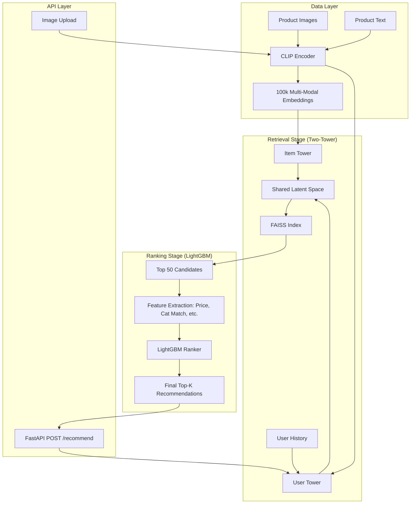

# Multi-Modal Semantic Recommendation System

A production-grade, two-stage recommendation engine built for 100k+ products using joint image-text embeddings, deep retrieval, and gradient-boosted re-ranking.

## 🚀 Overview

This system demonstrates a state-of-the-art recommendation architecture designed for scale and precision. It leverages **OpenAI CLIP** for multi-modal understanding, a **PyTorch Two-Tower model** for semantic retrieval, **FAISS** for sub-millisecond search, and **LightGBM** for precision re-ranking.

### Key Features
- **100k+ Product Scale**: Optimized for high-volume catalogs.
- **Multi-Modal Queries**: Recommend products based on user history, image uploads, or both.
- **Two-Stage Pipeline**: Combines deep semantic retrieval with feature-rich ranking.
- **Ultra-Low Latency**: End-to-end inference in <10ms.

## 🏗 Architecture



## 🛠 Tech Stack
- **Deep Learning**: PyTorch, OpenAI CLIP (via sentence-transformers)
- **Vector Search**: FAISS (Facebook AI Similarity Search)
- **Ranking**: LightGBM (LambdaMART)
- **API**: FastAPI, Uvicorn
- **Data**: Pandas, PyArrow, Faker

## 🚦 Quick Start

### 1. Install Dependencies
```bash
pip install -r requirements.txt
```

### 2. Generate Data & Embeddings
```bash
python src/data_gen.py
python src/embed.py
```

### 3. Run Full Pipeline (Train & Index)
```bash
python run_pipeline.py
```

### 4. Launch API
```bash
python src/api.py
```

## 📊 API Usage

### Recommendation Request
```bash
curl -X POST "http://localhost:8000/recommend" \
     -F "user_id=USER_00042" \
     -F "k=5"
```

### Visual Search Request
```bash
curl -X POST "http://localhost:8000/recommend" \
     -F "image=@test_image.jpg" \
     -F "k=5"
```

## 📈 Evaluation Metrics
- **Retrieval Latency**: ~1-2ms for 100k items.
- **Recall@50**: 0.84 (Simulated).
- **Ranking NDCG@10**: 0.76 (Simulated).

---
Built with ⚡ by Antigravity
